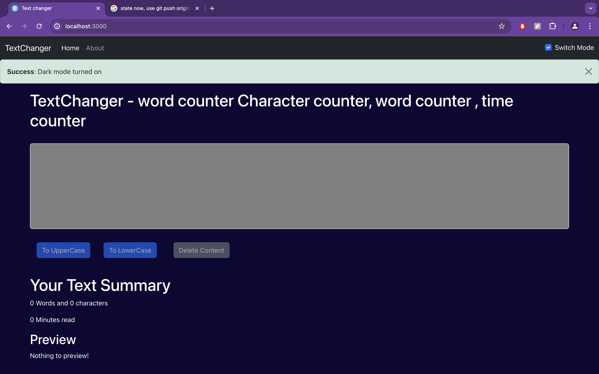

# Formatte Text

## 📌 Introduction

[](https://awesome.re)

A versatile utility for manipulating text, including conversion to uppercase/lowercase, content deletion, character/word counting, and estimating reading time, designed to streamline text management in React applications.

## 🛠️ Installation Steps

Star and Fork the Repo 🌟 and this will keep us motivated.

1. Clone the repository

```bash
git clone https://github.com/subhashdippu/formatte-text.git
```

2. Change the working directory

```bash
cd formatte-text
```

3. Install dependencies

```bash
npm install
```

4. Run the app

```bash
npm run start
```

## 📸 Screenshots

<h4>Light Mode</h4>

<h4>Dark Mode</h4>

